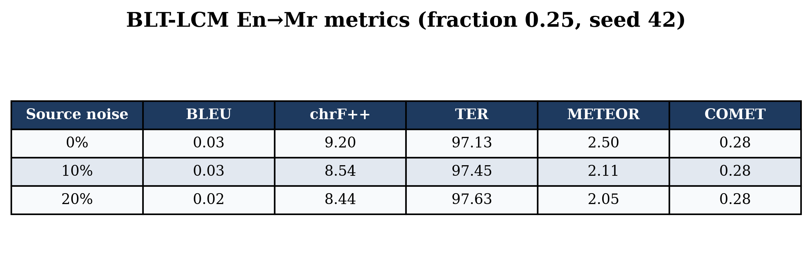
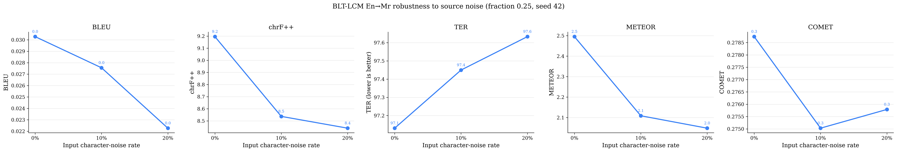
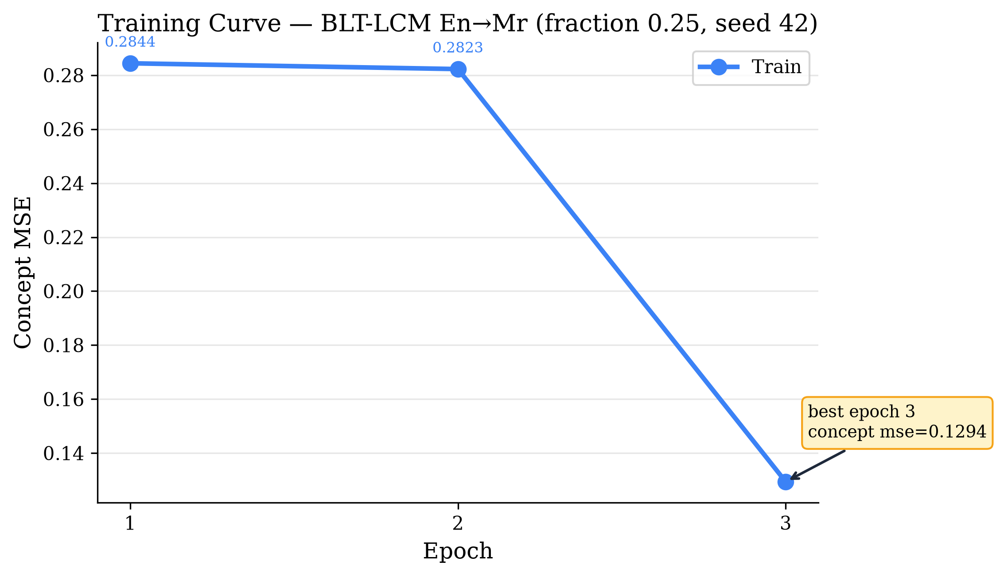
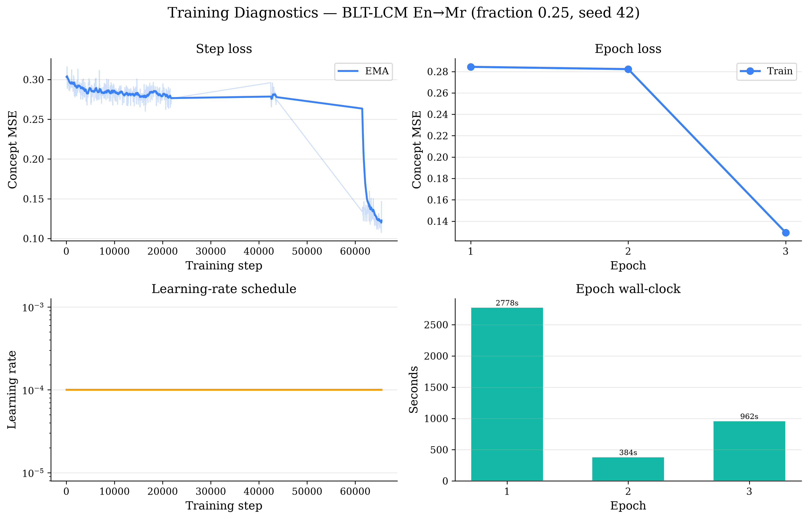

# lcm_blt_mt_fraction0.25_s42

* script: `train_lcm_blt_mt.py`
* finished: 2026-08-16T14:12:43Z
* wall clock: 0.1 s
* code: `5fe542d` on `main` (working tree dirty)
* device: NVIDIA RTX PRO 6000 Blackwell Server Edition

## Results

| metric | value |
| --- | --- |
| final_train_loss | 0.12937786251284658 |
| best_epoch | 3 |
| epochs_run | 3 |
| clean_fraction | 0.25 |
| clean_noise | 0.0 |
| clean_BLEU | 0.030281111956288156 |
| clean_chrF++ | 9.195487341864572 |
| clean_TER | 97.13090257023312 |
| clean_METEOR | 2.4952171865090156 |
| clean_COMET | 0.27874162030220034 |

## Run info

| key | value |
| --- | --- |
| seed | 42 |
| data_seed | 42 |
| train_pairs | 698519 |
| eval_pairs | 500 |
| noise_levels | [0.0, 0.1, 0.2] |
| mode | fixed |
| cap | 3 |
| patience | 3 |
| min_delta | 0.0 |
| min_epochs | 1 |
| epochs_observed | 3 |
| best | 0.12937786251284658 |
| best_epoch | 3 |
| epochs_since_improvement | 0 |
| stop_reason | reached the --epochs cap of 3 |

## Figures

### lcm_blt_mt_fraction0.25_s42_metrics_table.png

### lcm_blt_mt_fraction0.25_s42_noise_robustness.png

### lcm_blt_mt_fraction0.25_s42_training_curve.png

### lcm_blt_mt_fraction0.25_s42_training_dashboard.png

Full hyperparameters, metrics and environment: [`run.json`](run.json).
