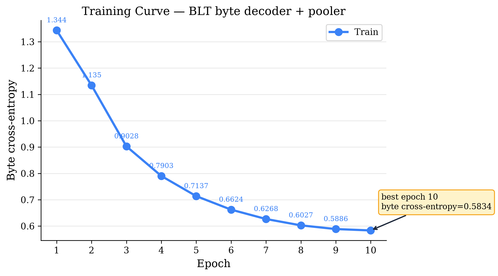
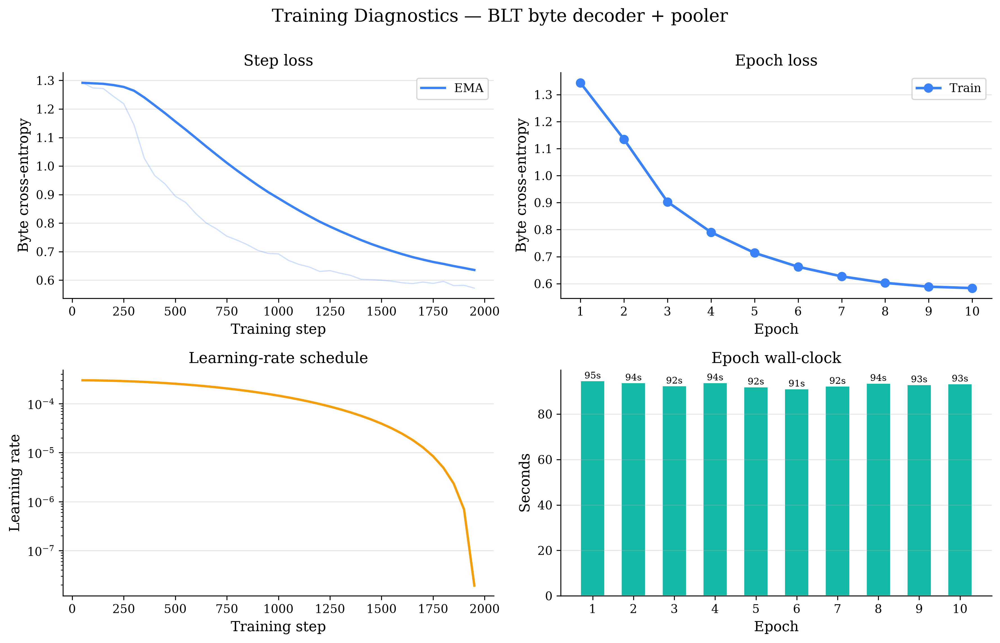

# blt_decoder

* script: `blt_decoder.py`
* finished: 2026-08-17T04:47:42Z
* wall clock: 1056.8 s
* code: `1fbad41` on `main` (working tree dirty)
* device: NVIDIA RTX PRO 6000 Blackwell Server Edition

## Results

| metric | value |
| --- | --- |
| best_byte_cross_entropy | 0.5834021835911031 |
| best_epoch | 10 |
| epochs_run | 10 |
| byte_perplexity | 1.7921252096908382 |

## Run info

| key | value |
| --- | --- |
| sentences | 50000 |
| train_pooler | True |
| threshold | 1.335 |
| decoder_parameters | 26543364 |
| mode | fixed |
| cap | 10 |
| patience | 3 |
| min_delta | 0.0 |
| min_epochs | 1 |
| epochs_observed | 10 |
| best | 0.5834021835911031 |
| best_epoch | 10 |
| epochs_since_improvement | 0 |
| stop_reason | reached the --epochs cap of 10 |

## Figures

### blt_decoder_training_curve.png

### blt_decoder_training_dashboard.png

Full hyperparameters, metrics and environment: [`run.json`](run.json).
